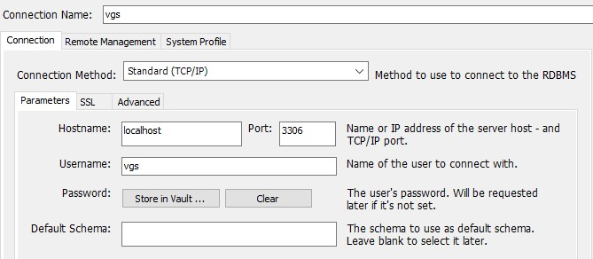

> O VideoGameShop - VGS, é uma aplicação desenvolvida com Java 8 e o framework Spring Boot na sua versão 2.1.3, usando conexão com banco de dados MySQL ou em memória com a dependência H2 do Spring Boot, o objetivo principal da aplicação é disponibilizar uma lista com gêneros de jogos eletrônicos, onde o usuário pode visualizar e adicionar o item que lhe despertar interesse e a partir daí, finalizar sua compra escolhendo o tipo de pagamento em boleto ou cartão, após concluir esta ação um e-mail é enviado contendo os detalhes da compra. Contudo, para que estas funcionalidades sejam acessadas, existe a necessidade que o usuário cadastre-se no VGS, informando o nome e um endereço de e-mail válido.

# Tecnologias usadas
  * [Java 8](https://www.java.com/pt_BR/download/)
  * [Spring Boot 2.1.3](https://spring.io/projects/spring-boot)
  * [MySQL 8.0](https://dev.mysql.com/)

# Aplicações necessárias para execução do projeto
  * [Spring Tool Suite](https://spring.io/tools3/sts/all)
  * [Postman](https://www.getpostman.com/downloads/)
  * [MySQL Workbench](https://dev.mysql.com/downloads/workbench/)

# Fazendo o download ou o clone do VGS

Após a intalação das aplicações necessárias, realize o download do projeto, neste [link](https://github.com/lfnd0/LP2_P2_Video_Game_Shop/archive/master.zip). Ou se preferir, abra o terminal da sua máquina que reconheça os comados do `Git` e digite:

```sh
git clone https://github.com/lfnd0/LP2_P2_Video_Game_Shop.git
```

Aguarde o download ou o comando `git clone` do VGS ser finalizado, em seguida abra o `Spring Tool Suite`, navegue até o diretório que você escolheu para a atividade anterior e faça a importação do projeto. Espere até que as dependências do `Maven` sejam instaladas para de fato executar a aplicação.

# Utilizando o VGS

Para usar o VGS execute o projeto e utilize o `Postman` para realizar as requisições `HTTP`. Abaixo encontram-se os endereços para tais requisições:

### Visualizar todos os gêneros:
```sh
http://localhost:8080/vgs/generos
```
### Visualizar todos os jogos:
```sh
http://localhost:8080/vgs/jogos
```
### Visualizar todos os usuários:
```sh
http://localhost:8080/vgs/usuarios
```
### Visualizar compra:
```sh
http://localhost:8080/vgs/compras/id
```
### Criar novo usuário:
```sh
http://localhost:8080/vgs/usuarios
```
### Realizar compra:
```sh
http://localhost:8080/vgs/compras
```

**Observação 1**: navegue entre os diretórios do projeto e localize a pasta `json`, lá encontram-se a estrura dos arquivos a criação de usuário e relização de compra.

**Observação 2**: para vizualizar gênero, jogo e usuário individualmente, basta passar o /id na requisição `HTTP`.

# Atenção quanto ao modo de persistência de dados

Por padrão o VGS usa o banco de dados H2 - em memória, para realizar a persistência de dados. Se você deseja usar o `MySQL Workbench` para esta tarefa, tenha certeza de ter instalado o mesmo e criado um novo usuário com todas as permições e as seguintes configurações para name/password: `vgs`. Por fim, inicie a criação de uma nova conexão conforme as informações contidas na imagem abaixo e execute o projeto:



Em seguinda, localize o arquivo `application.properties` e mude o valor da chave:

```sh
spring.profiles.active=teste
```
Para:

```sh
spring.profiles.active=producao
```
# Time de desenvolvimento

  * [Danillo Rodrigues](https://github.com/danilo100kl)
  * [João Marcos](https://github.com/JoaoMarcoss)
  * [Luiz Fernando](https://github.com/lfnd0)